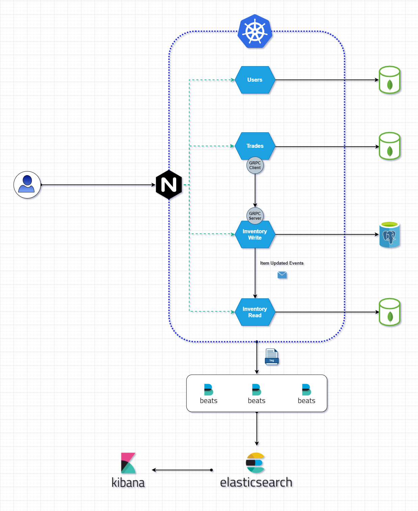

# Tradew Users

## Overview
The `users` microservice is responsible for managing all the application users

## Usage
To start the server on port `9000` run the command:
```
go run main.go api
```

## Docker

You can also run using docker, go in the root of the workspace and run:
```
docker build . -t users
docker run users -p 9000:9000
```


## Architecture overview

